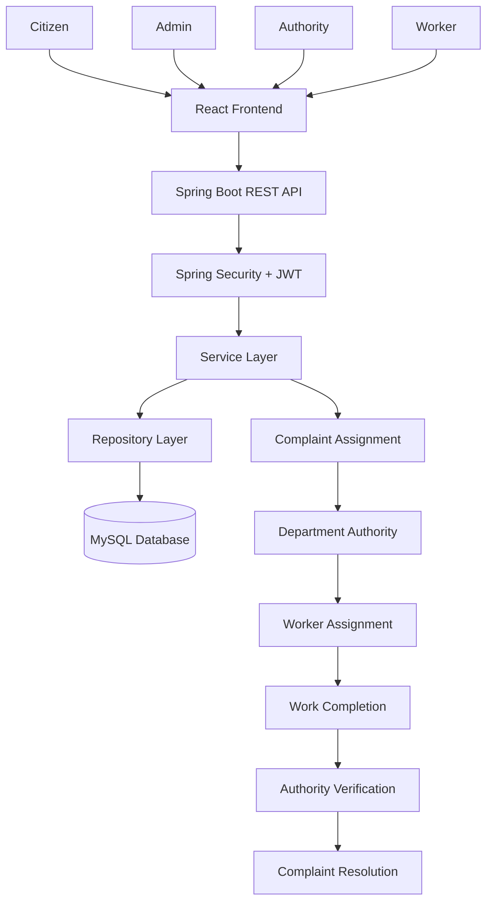

# 🏙️ CivicFix — Smart Civic Issue Reporting & Management System

**Making cities smarter, one complaint at a time.**

CivicFix is a full-stack civic issue reporting and management platform designed to bridge the gap between citizens and municipal authorities. It simplifies the process of reporting local problems, automatically routes complaints to the relevant departments, and enables transparent tracking from submission to resolution.

Instead of visiting government offices and navigating manual complaint procedures, citizens can report civic issues online and track their progress using a unique registration ID.

## 🚀 Key Features

- 📝 **Smart Complaint Registration:** Citizens can report civic issues such as potholes, garbage accumulation, water leakage, drainage problems, and damaged streetlights.
- 🔄 **Automated Department Assignment:** Complaints can be routed to the appropriate authority based on the reported issue and department.
- 🏢 **Role-Based Access Control:** Dedicated dashboards and permissions for Citizens, Admins, Authorities, and Workers.
- 📍 **Complaint Tracking:** Track complaints using a unique registration ID and monitor their current status.
- 👨‍🔧 **Worker Management:** Authorities can assign complaints to workers and monitor their progress.
- ✅ **Resolution Verification:** Authorities verify completed work before marking complaints as resolved.
- 📊 **Admin Dashboard:** Manage authorities and workers and monitor the overall complaint management process.
- 🔐 **Secure Authentication:** JWT-based authentication and BCrypt password hashing for secure user access.
- 📱 **Responsive Interface:** A user-friendly interface designed to work across different screen sizes.

## 🛠️ Tech Stack

| Layer | Technology |
|---|---|
| Frontend | React.js (JSX) |
| Styling | CSS |
| Backend | Java 21, Spring Boot |
| Security | Spring Security, JWT |
| Database | MySQL |
| ORM | Spring Data JPA, Hibernate |
| Authentication | JWT, BCrypt |
| Build Tool | Maven |
| Version Control | Git, GitHub |

## 🏗️ System Architecture



## 🔄 How CivicFix Works

### 1. Citizen Reports an Issue
- The citizen registers or logs in.
- Selects the category of the civic issue.
- Provides a description and relevant details.
- Submits the complaint and receives a unique registration ID.

### 2. Complaint Assignment
- The backend processes the submitted complaint.
- Based on the issue category, the system identifies the relevant department.
- The complaint is forwarded to the corresponding authority through the assignment workflow.

### 3. Authority Reviews the Complaint
- The authority reviews incoming complaints.
- Assigns tasks to available workers.
- Monitors the progress of assigned tasks.

### 4. Worker Resolves the Issue
- The worker views assigned tasks.
- Performs the required work.
- Updates the task status after completion.

### 5. Authority Verifies Resolution
- The authority reviews the worker's completion update.
- Verifies the resolution.
- Marks the complaint as resolved.

### 6. Citizen Tracks Progress
- Citizens can use their registration ID to check complaint status.
- The complaint lifecycle provides visibility into the progress of the reported issue.

## 👥 User Roles

| Role | Responsibilities |
|---|---|
| Citizen | Register, submit complaints, track complaint status |
| Admin | Manage authorities and workers, oversee the system |
| Authority | Manage departmental complaints, assign workers, verify resolutions |
| Worker | View assigned tasks and update completion status |

## 🗄️ Database Design

CivicFix uses MySQL for persistent data storage and Spring Data JPA for database interactions.

Core entities include:

- **Users:** Stores user information, credentials, and role information.
- **Complaints:** Stores complaint details, category, registration ID, and status.
- **Departments:** Represents civic departments responsible for resolving different issue categories.
- **Assignments:** Tracks the relationship between complaints, authorities, and workers.
- **Task Updates:** Records progress and completion updates for assigned work.

The database structure can be extended to support notifications, complaint history, analytics, and audit logs.

## 📂 Project Structure

```text
CivicFix/
│
├── frontend/
│   ├── public/
│   ├── src/
│   │   ├── components/
│   │   ├── pages/
│   │   ├── services/
│   │   ├── assets/
│   │   └── App.jsx
│   └── package.json
│
├── backend/
│   ├── src/
│   │   ├── main/
│   │   │   ├── java/
│   │   │   │   └── com/backendSih/civifix/
│   │   │   │       ├── config/
│   │   │   │       ├── controller/
│   │   │   │       ├── dto/
│   │   │   │       ├── entity/
│   │   │   │       ├── repository/
│   │   │   │       ├── security/
│   │   │   │       └── service/
│   │   │   └── resources/
│   │   │       └── application.properties
│   │   └── test/
│   └── pom.xml
│
└── README.md
```

*Note: Adjust the directory names to match the actual repository structure.*

## ⚙️ Installation and Setup

### Prerequisites

Make sure you have the following installed:

- Node.js and npm
- Java 21 or compatible JDK
- Maven
- MySQL 8.0+
- Git

### 1. Clone the Repository

```bash
git clone https://github.com/SatyamKYadav23/CivicFix.git
cd CivicFix
```

### 2. Set Up the Database

Create a MySQL database:

```sql
CREATE DATABASE civicfix;
```

Configure the database connection in the backend's `application.properties` file:

```properties
spring.datasource.url=jdbc:mysql://localhost:3306/civicfix
spring.datasource.username=${DB_USERNAME}
spring.datasource.password=${DB_PASSWORD}

spring.jpa.hibernate.ddl-auto=update
```

Set your database credentials using environment variables before running the backend. Configure any additional properties required by your application.

### 3. Run the Backend

Navigate to the backend directory:

```bash
cd backend
```

Run the Spring Boot application:

```bash
./mvnw spring-boot:run
```

On Windows:

```bash
mvnw.cmd spring-boot:run
```

The backend will run on the configured Spring Boot port, typically:

```text
http://localhost:8080
```

### 4. Run the Frontend

Open a new terminal and navigate to the frontend directory:

```bash
cd frontend
```

Install dependencies:

```bash
npm install
```

Start the development server:

```bash
npm run dev
```

If the project uses a different frontend build tool, use the appropriate start command from `package.json`.

Open the local frontend URL displayed in the terminal.

## 🔐 Authentication and Security

CivicFix implements a secure authentication flow using Spring Security and JWT.

- Passwords are hashed using BCrypt.
- JWT tokens are generated after successful authentication.
- Protected endpoints require authentication.
- Role-based authorization restricts access according to user permissions.
- Administrative accounts are managed separately from citizen registration.

## 🌱 Future Enhancements

- 🤖 AI-powered complaint classification and automatic routing.
- 🗺️ Interactive maps for location-based complaint reporting.
- 📸 Image-based issue verification.
- 🔔 Real-time notifications for complaint updates.
- 📈 Analytics dashboard for identifying recurring civic problems.
- ☁️ Cloud deployment and scalable infrastructure.
- 📱 Mobile application for easier citizen access.

## 🎯 Project Objective

The main objective of CivicFix is to reduce the friction between citizens and municipal authorities by digitizing the complaint management lifecycle.

By combining automated assignment, role-based workflows, and transparent complaint tracking, CivicFix aims to improve coordination, accountability, and accessibility in civic issue resolution.

## 👨‍💻 Developer

**Satyam Kumar Yadav**

Computer Science and Engineering Student | Full-Stack Developer

- GitHub: [@SatyamKYadav23](https://github.com/SatyamKYadav23)
- Project Repository: [CivicFix](https://github.com/SatyamKYadav23/CivicFix)

---

⭐ If you find this project interesting, consider giving the repository a star!

**Built with ❤️ to make civic problem-solving simpler and more transparent.**
