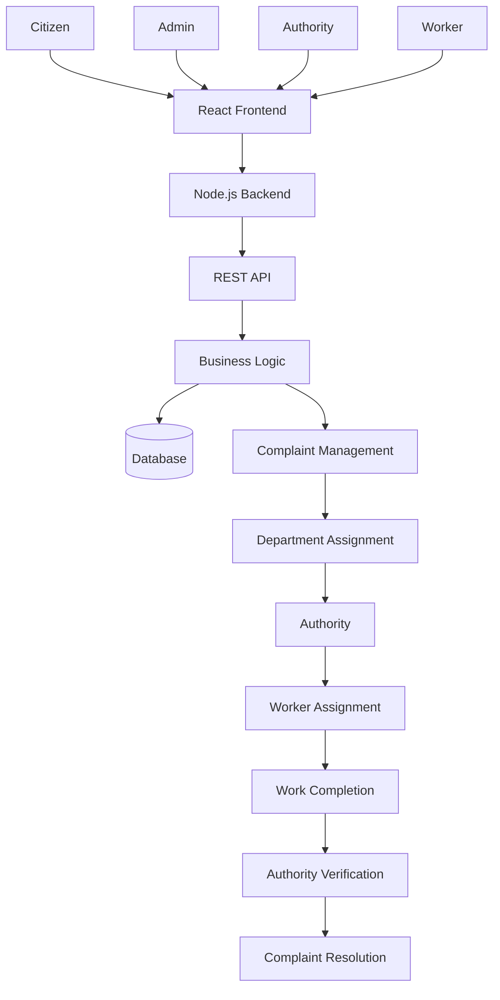

# 🏙️ CivicFix — Smart Civic Issue Reporting & Management System

**Making cities smarter, one complaint at a time.**

CivicFix is a full-stack web application designed to simplify civic issue reporting and improve coordination between citizens and municipal authorities.

From reporting potholes and garbage problems to tracking complaints and managing resolution workflows, CivicFix provides a centralized platform that makes civic issue management more accessible, transparent, and efficient.

Instead of visiting government offices and dealing with lengthy manual procedures, citizens can report problems online and track their progress using a unique registration ID.

## 🚀 Features

- 📝 **Online Complaint Registration** — Citizens can report civic issues such as potholes, garbage accumulation, water leakage, drainage problems, and damaged streetlights.
- 🔍 **Complaint Tracking** — Track complaints using a unique registration ID.
- 🏢 **Department-Based Assignment** — Route complaints to the appropriate municipal department based on the issue category.
- 👥 **Role-Based Access** — Separate workflows for citizens, administrators, authorities, and workers.
- 👨‍🔧 **Worker Management** — Authorities can assign tasks to workers and monitor their progress.
- ✅ **Complaint Resolution** — Support a workflow in which completed work is reviewed and verified by the responsible authority.
- 📊 **Admin Dashboard** — Centralized management of authorities, workers, and complaint operations.
- 🔐 **Authentication and Authorization** — Secure access to application features based on user roles.
- 📱 **Responsive UI** — A clean interface designed for different screen sizes.

## 🛠️ Tech Stack

| Layer | Technology |
|---|---|
| Frontend | React.js |
| Language | JavaScript (JSX) |
| Backend | Node.js |
| API | REST API |
| Database | Configure according to the current implementation |
| Styling | CSS |
| Authentication | Based on the current backend implementation |
| Version Control | Git, GitHub |

## 🏗️ System Architecture



## 🔄 Application Workflow

### 1. Complaint Registration
- Citizens register or log in.
- Select the relevant civic issue category.
- Submit complaint details.
- Receive a unique registration ID.

### 2. Complaint Processing
- The backend receives and processes the complaint.
- The complaint is associated with the relevant department.
- The responsible authority can review and manage the complaint.

### 3. Worker Assignment
- Authorities review pending complaints.
- Assign tasks to workers.
- Monitor the progress of ongoing work.

### 4. Issue Resolution
- Workers complete their assigned tasks.
- Update the task status.
- Authorities verify the completed work and update the complaint status.

### 5. Complaint Tracking
- Citizens use their registration ID to check the status of their complaints.
- Complaint progress is made easier to follow through a centralized interface.

## 👥 User Roles

| Role | Responsibilities |
|---|---|
| Citizen | Submit complaints and track their status |
| Admin | Manage authorities and workers and oversee operations |
| Authority | Handle departmental complaints, assign workers, verify resolutions |
| Worker | View assigned tasks and update work progress |

## 📂 Project Structure

```text
CivicFix/
│
├── frontend/
│   ├── public/
│   ├── src/
│   │   ├── components/
│   │   ├── pages/
│   │   ├── services/
│   │   ├── assets/
│   │   └── App.jsx
│   └── package.json
│
├── backend/
│   ├── src/
│   │   ├── controllers/
│   │   ├── routes/
│   │   ├── models/
│   │   ├── middleware/
│   │   ├── services/
│   │   └── config/
│   ├── package.json
│   └── server.js
│
└── README.md
```

*The structure above is illustrative. Adjust the folder and file names to match your actual repository.*

## ⚙️ Installation and Setup

### Prerequisites

- Node.js
- npm
- Git
- Database server, if required by your backend

### 1. Clone the Repository

```bash
git clone https://github.com/SatyamKYadav23/CivicFix.git
cd CivicFix
```

### 2. Set Up the Backend

```bash
cd backend
npm install
```

Create a `.env` file in the backend directory and add the configuration required by your application.

Example:

```env
PORT=5000
```

Add your database credentials, JWT secret, or other required variables if your application uses them. Do not commit sensitive credentials.

Start the backend using the script configured in `package.json`. For example:

```bash
npm start
```

For development, if a development script exists:

```bash
npm run dev
```

### 3. Set Up the Frontend

Open a new terminal:

```bash
cd frontend
npm install
```

Start the frontend:

```bash
npm run dev
```

Open the local URL displayed in your terminal to access CivicFix.

## 🔐 Security

CivicFix is designed around role-based access and secure application workflows.

Security considerations include:

- Authentication for protected resources.
- Authorization based on user roles.
- Secure password handling.
- Validation of incoming requests.
- Protected administrative operations.
- Environment-based configuration for sensitive credentials.

The specific security mechanisms depend on the current backend implementation.

## 🌱 Future Enhancements

- 🤖 AI-powered complaint classification.
- 🗺️ Map-based complaint reporting and location tracking.
- 📸 Image-based civic issue verification.
- 🔔 Real-time complaint status notifications.
- 📊 Advanced analytics and reporting dashboards.
- ☁️ Cloud deployment and scalable infrastructure.
- 📱 Dedicated mobile application.
- ⚡ More intelligent department assignment and task prioritization.

## 🎯 Project Objective

CivicFix aims to bridge the gap between citizens and municipal authorities by digitizing the complete civic complaint management process.

The platform focuses on reducing manual effort, improving departmental coordination, and providing greater transparency in resolving everyday civic problems.

## 👨‍💻 Developer

**Satyam Kumar Yadav**

Computer Science and Engineering Student | Full-Stack Developer

- GitHub: [@SatyamKYadav23](https://github.com/SatyamKYadav23)
- Repository: [CivicFix](https://github.com/SatyamKYadav23/CivicFix)

---

⭐ If you find CivicFix interesting, consider giving this repository a star!

**Built with ❤️ to make civic problem-solving simpler and smarter.**
